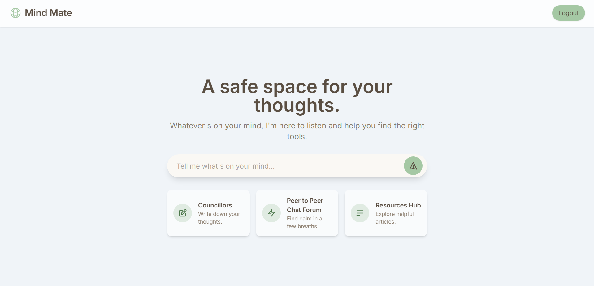
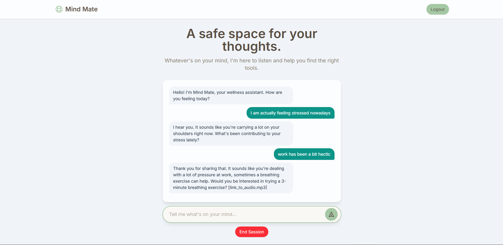
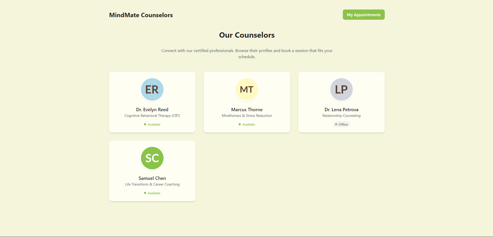
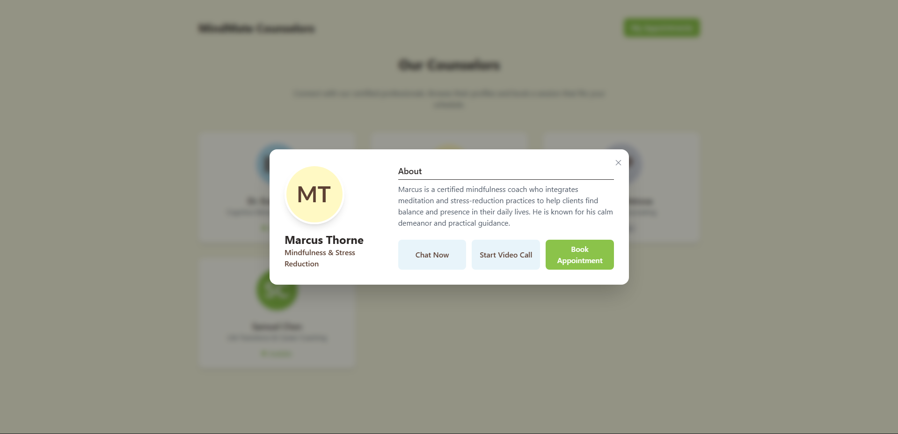
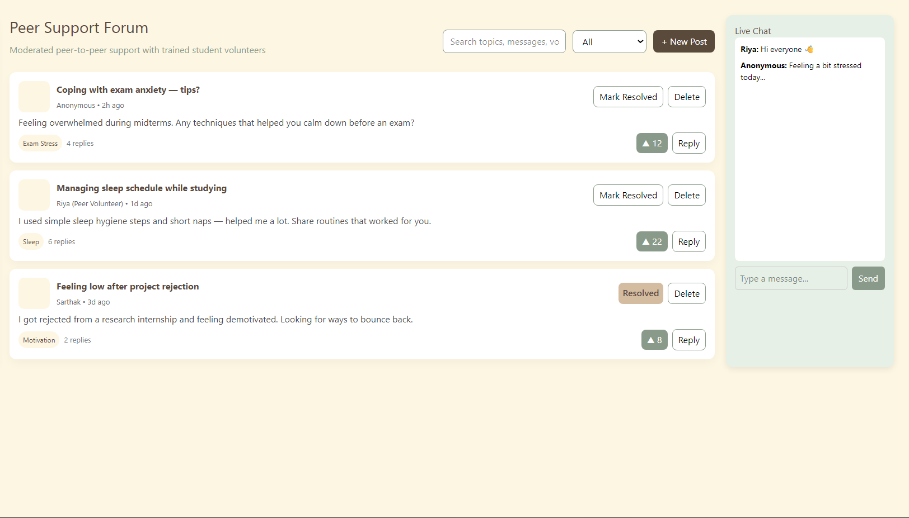
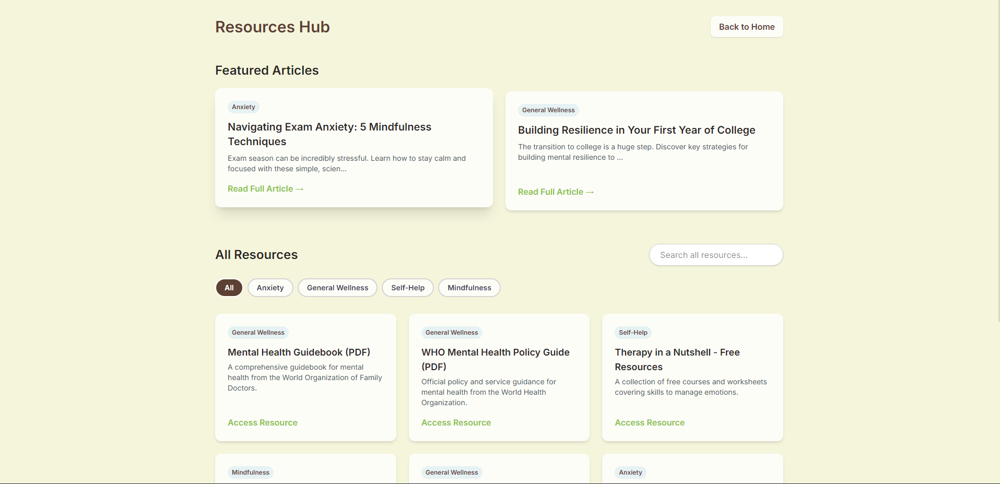
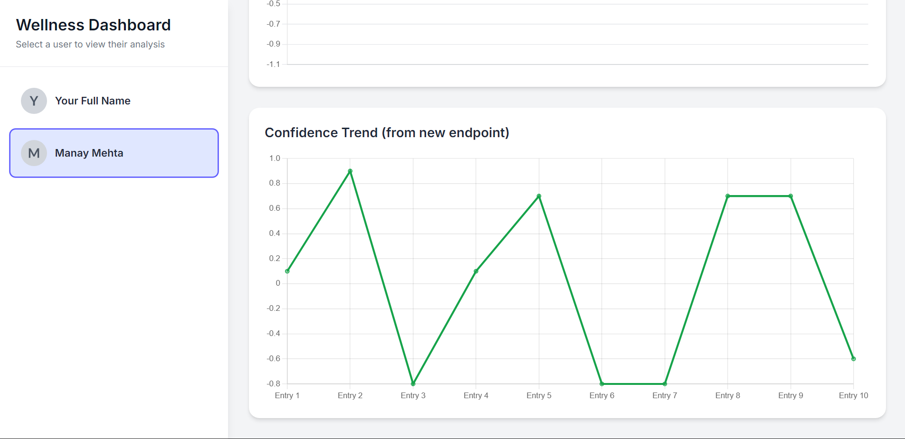

# 🧠 MindMate – AI-Powered Mental Wellness Platform  
> *"A safe space for students to talk, reflect, and grow."*

---

## 🌟 Overview  
**MindMate** is a full-stack **AI-powered mental wellness application** designed to provide emotional support and self-awareness tools for students.  
It combines a **chatbot**, **counsellor connections**, **peer community**, and **wellness resources** into one intuitive platform — with built-in **sentiment and confidence tracking** powered by Gemini AI.

---

## 🖼️ Screenshots  

| Home | AI Chat | 
|----------------|--------------|
|  |  |

| Counsellors | Options | 
|----------------|--------------|
|  |  |

| Peer to Peer | Resources | 
|----------------|--------------|
|  |  |

| Admin |
|----------------|
|  |


---

## ✨ Features  

- 💬 **AI Chatbot** — Empathetic conversations powered by Gemini LLM through FastAPI.  
- 🧠 **Sentiment & Confidence Analysis** — Generates emotional insights and visual graphs.  
- 👩‍⚕️ **Counsellor Connect** — Browse and reach out to verified mental health professionals.  
- 🫂 **Peer Forum** — Share and discuss experiences with others anonymously.  
- 📚 **Resource Hub** — Curated wellness articles, coping guides, and helplines.  
- 🔒 **Authentication** — Secure JWT-based login & bcrypt-encrypted passwords.  
- 📈 **Progress Dashboard** — Visual trends of emotional well-being over time.  
- ⚠️ **Safety Layer** — Detects distress signals and provides verified helpline links.

---

## 🧩 Tech Stack  

| Layer | Technologies |
|-------|---------------|
| **Frontend** | React, Tailwind CSS, Zustand |
| **Backend (Main)** | Node.js, Express |
| **Backend (AI Layer)** | FastAPI (Python), Gemini API |
| **Database** | MongoDB Atlas |
| **Authentication** | JWT, bcrypt |
| **AI / NLP** | Gemini 2.0 Flash, spaCy |
| **Charts** | Recharts / Chart.js |
| **Deployment** | Vercel (Frontend), Render (FastAPI), MongoDB Atlas (DB) |

---

## 🧠 AI Workflow  

```mermaid
flowchart TD
    A[User Message] --> B[FastAPI Endpoint /api/chat]
    B --> C[Gemini LLM Generates Empathetic Response]
    C --> D[Chat UI Displays Response]
    D --> E[FastAPI /api/sentiment]
    E --> F[Gemini LLM Analyzes Transcript]
    F --> G[Confidence & Sentiment Graphs Updated]
